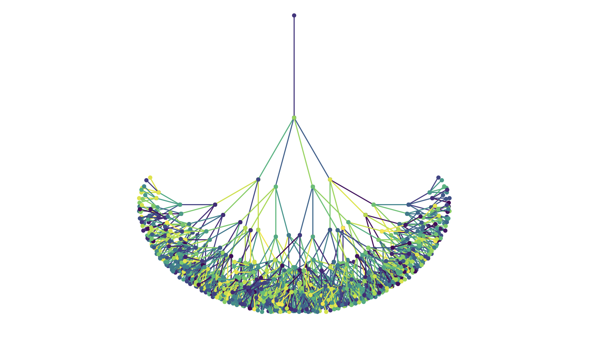

# what-the-fract

---

# Fractals, Neural Networks, and the Mathematical Symphony of Nature

Have you ever noticed the spiral arms of a galaxy or the swirling eye of a hurricane and wondered if there's a deeper connection behind these patterns? These seemingly simple designs are actually governed by mathematical principles that repeat themselves at every scale.

## Crafting a Neural-Like Fractal

At its core, the provided Python script employs recursion and the power of the `matplotlib` library to generate intricate, branching patterns. Here’s a brief overview of how it works:

1. **Recursive Branch Drawing**: The `draw_branch` function recursively creates branches, each time reducing the length and altering the angle to produce a complex, tree-like structure.
2. **Color Variation**: By selecting random colors from the `viridis` colormap, each branch gains a unique hue, enhancing the visual complexity.
3. **Fractal Complexity**: Additional branches are introduced at each step without complicating the code, achieving a rich, self-similar pattern.
4. **Visualization**: The `draw_neural_fractal` function sets up the plot, initiates the recursion, and displays the final fractal image.

When executed, this script generates a mesmerizing fractal that echoes the intricate architecture of neural networks found in the human brain.

## Self-Similarity and the Essence of Fractals

Fractals are mathematical constructs characterized by self-similarity—each part of the fractal resembles the whole. This property is vividly displayed in the recursive branch drawing of our script. As each branch splits into smaller ones, the pattern repeats at every scale, creating an infinite tapestry of complexity from simple rules.

Self-similarity is not confined to mathematics; it permeates nature. From the branching of trees and the spirals of shells to the structure of blood vessels and the formation of galaxies, fractal patterns provide an efficient and aesthetically pleasing way to organize space and resources.

## **Fractals and Self-Similarity: Patterns That Repeat**

Think about the spiral arms of the Milky Way or the intricate structure of a hurricane. These patterns aren't random—they repeat themselves no matter how closely you look. This property is called **self-similarity**, and it's a fundamental aspect of **fractals**. Fractals are patterns that look similar at any scale, creating complexity from simple rules.

**Real-World Fractals:**

- **Galaxies:** The spiral arms of galaxies mirror the overall structure of the galaxy, creating a harmonious and balanced appearance.
- **Hurricanes:** The eye of a hurricane and its surrounding spiral bands exhibit self-similar patterns, making the storm both powerful and organized.
- **Lightning Bolts:** Each branch of a lightning bolt replicates the shape of the entire discharge, forming a complex yet patterned display.
- **River Systems:** The way rivers branch out into smaller streams follows a fractal pattern, efficiently distributing water across the landscape.

Fractals show us how simple processes can lead to intricate and beautiful outcomes, a concept that applies both in nature and in the technologies we develop.

## Neural Networks: Nature’s Fractal Architects

The human brain, with its approximately 86 billion neurons interconnected in intricate networks, exhibits a form of fractal organization. This neural architecture is not only efficient in processing information but also remarkably resilient and adaptable. The recursive drawing of branches in our script mirrors this biological complexity, hinting at the profound connections between mathematical recursion and neural structuring.

Artificial Neural Networks (ANNs), the backbone of modern AI, draw inspiration from this biological paradigm. By mimicking the brain’s ability to learn and adapt through interconnected nodes, ANNs have revolutionized fields ranging from image recognition to natural language processing. The fractal-like expansion of branches in our script serves as a metaphor for the layered complexity and scalability inherent in neural networks.

## **The Golden Ratio: Nature’s Perfect Proportion**

The **golden ratio**, approximately 1.618, is a special number that appears in various aspects of nature and art. Represented by the Greek letter phi (Φ), it describes a proportion where the ratio of the whole to the larger part is the same as the ratio of the larger part to the smaller one.

**Examples of the Golden Ratio:**

- **Galactic Spirals:** The arms of spiral galaxies expand in a way that aligns with the golden ratio, contributing to their balanced and expansive structure.
- **Hurricane Spirals:** The formation of hurricane spirals can reflect proportions related to the golden ratio, adding to their organized yet dynamic nature.
- **Pinecones and Pineapples:** The arrangement of scales in pinecones and the patterning on pineapples follow Fibonacci sequences, which are closely related to the golden ratio.
- **Sunflowers:** The seeds in a sunflower's head grow in spirals that follow the golden ratio, allowing for optimal packing and growth.

The golden ratio helps explain why certain patterns in nature are so pleasing to the eye and how efficient growth can be achieved through simple mathematical principles.

---

## Nature and Mathematics: An Intrinsic Dance

The interplay between nature and mathematics is a testament to the universe’s underlying order. Mathematical models provide a language to describe and predict natural phenomena, revealing patterns that might otherwise remain concealed. Fractals, the golden ratio, and neural networks are just a few examples where mathematics and nature coalesce, offering insights into the complexity and elegance of the world around us.

Whether it’s the spiraling arms of a galaxy, the branching of trees, or the intricate networks of our own brains, mathematics serves as both a descriptive and generative force, enabling us to understand and recreate the marvels of nature through computational means.

## Infinite Scaling: Fractals, Compute, and the Boundless Horizon of AI

Fractals, by their very nature, possess infinite scalability. Each iteration reveals more detail, and the pattern continues to unfold without end. Similarly, computational power and artificial intelligence are on a trajectory of exponential growth, pushing the boundaries of what machines can achieve.

Imagine an AI system that harnesses the infinite scalability of fractals, where each layer of computation unlocks new levels of understanding and creativity. Just as fractals reveal deeper patterns with each zoom, AI could explore ever more complex dimensions of data, learning and evolving in ways that mirror the recursive beauty of natural systems.

This convergence of fractal mathematics and advanced computing hints at a future where AI not only mimics but also enhances the fractal complexity of natural intelligence. Such a synergy could lead to breakthroughs in how we comprehend consciousness, creativity, and the very fabric of reality itself.

## Conclusion: Embracing the Infinite

The Python script that generates a fractal neural network is more than just a piece of code—it’s a window into the infinite possibilities that lie at the intersection of mathematics, nature, and artificial intelligence. As we delve deeper into the recursive patterns that shape our world, we uncover a profound connection between the simplicity of mathematical rules and the complexity of natural systems.

Fractals teach us that from simple beginnings can emerge infinite complexity, a lesson that resonates deeply in the realm of AI. As compute continues to scale, embracing the fractal nature of intelligence could unlock new horizons, enabling machines to reach unprecedented levels of understanding and creativity.

In this dance between the finite and the infinite, between code and consciousness, we find a reflection of our own quest for knowledge and the timeless patterns that define our universe.

---

## **Connecting the Dots: Why These Patterns Matter**

The neural network you create with this code isn't just a cool visual—it's a representation of how mathematics, nature, and technology are interconnected.

---

## **Conclusion: Discovering Patterns in Our World**

Our exploration of fractals, the golden ratio, and neural networks reveals a world filled with repeating patterns and harmonious proportions. From the neurons in our brains and guts to the artificial intelligences we build, the principles of **self-similarity**, **fractals**, and the **golden ratio** are everywhere.

As we continue to uncover these patterns, we open doors to new possibilities, enhancing both our technological capabilities and our understanding of the natural world.

---

*Fractals aren't just mathematical curiosities—they're a window into the interconnectedness of our universe. By exploring these patterns, we gain insights that drive innovation and deepen our appreciation for the complexity and beauty of the world around us.*
