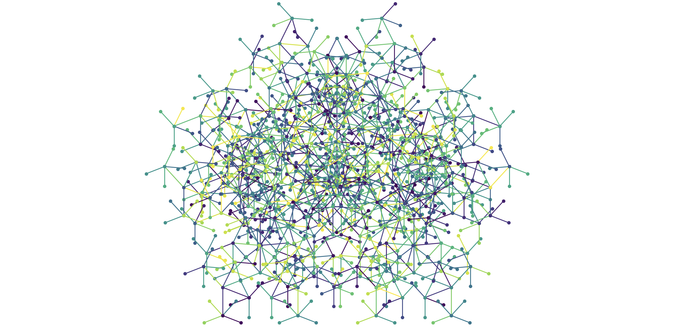

# what-the-fract



# Fractals, Neural Networks, and the Mathematical Symphony of Nature

```
AI models such as ChatGPT arrange concepts using geometric patterns, forming complex structures known as semantic crystals and concept clouds. These patterns illustrate how relationships between words, like “man” and “woman” or “king” and “queen,” create precise geometric shapes such as parallelograms. This geometric organization enables AI to process and relate information efficiently, functioning like a structured map of knowledge.
```

quote from [ChatGPT’s Hidden Brain: The AI Breakthrough Shocking Scientists [11/2024]](https://www.geeky-gadgets.com/chatgpt-brain-like-structures/?utm_source=flipboard&utm_content=topic%2Fcomputerscience)
[
PAPER: The Geometry of Concepts: Sparse Autoencoder Feature Structure](https://arxiv.org/abs/2410.19750)


---

Have you ever gazed at the spiral arms of a galaxy or watched the swirling eye of a hurricane and felt a sense of wonder? These awe-inspiring patterns aren't just random occurrences; they're manifestations of deep mathematical principles that echo throughout nature, art, and even technology. In this exploration, we'll delve into the fascinating interplay between fractals, neural networks, and the golden ratio, uncovering how these concepts weave a mathematical symphony that underpins the complexity of our universe.

## Crafting a Neural-Like Fractal

Using recursion and the powerful `matplotlib` library, this script generates intricate, branching fractal patterns that mirror the complexity of neural networks in the human brain. Here's a glimpse into its magic:

- **Recursive Branch Drawing**: The `draw_branch` function creates branches that split and diverge, each iteration reducing in length and altering in angle. This recursive process builds a complex, tree-like structure that grows organically.
- **Golden Ratio Branching**: The `draw_branch` function now uses the golden ratio to determine the angles at which branches diverge. This creates a more natural-looking fractal that mirrors patterns found in nature.
- **Color Variation**: By selecting random colors from the `viridis` colormap, each branch shines with a unique hue, adding depth and visual intrigue to the fractal.
- **Fractal Complexity**: Despite its simplicity, the script introduces additional branches at each step, resulting in a rich, self-similar pattern that captivates the eye.
- **Visualization**: The `draw_neural_fractal` function orchestrates the plotting, initiating the recursion and displaying the final mesmerizing fractal image.

## Self-Similarity: The Essence of Fractals

Fractals are more than just beautiful patterns; they embody the concept of **self-similarity**, where each part of the fractal mirrors the whole. This recursive repetition creates an infinite tapestry of complexity from simple, underlying rules. 

Consider the branching of trees, the spirals of shells, or the intricate structure of blood vessels. Each of these natural phenomena showcases self-similarity, organizing space and resources in efficient and aesthetically pleasing ways. This mathematical elegance isn't confined to nature alone—it permeates our technologies and innovations, revealing a universal language of patterns.

## Fractals and Self-Similarity: Patterns That Repeat


Imagine zooming into a river system. The way rivers branch into smaller streams mirrors the overall structure of the entire river network. This **self-similarity** is a hallmark of **fractals**, allowing for infinite detail and complexity at every scale.

### Real-World Fractals:

- **Galaxies**: The spiral arms of galaxies replicate the overall structure of the galaxy, creating a harmonious and balanced appearance.
- **Hurricanes**: The eye and spiral bands of hurricanes exhibit self-similar patterns, organizing immense energy into a structured system.
- **Lightning Bolts**: Each branch of a lightning bolt mirrors the shape of the entire discharge, forming a complex yet patterned display.
- **River Systems**: The branching of rivers into smaller streams follows a fractal pattern, efficiently distributing water across vast landscapes.

These patterns demonstrate how simple rules can lead to intricate and beautiful outcomes, bridging the gap between mathematics and the natural world.

## Neural Networks: Nature’s Fractal Architects


The human brain, with its approximately 86 billion neurons interconnected in intricate networks, is a marvel of natural engineering. Each neuron serves as a fundamental unit of this vast network, capable of transmitting electrical and chemical signals that facilitate everything from basic reflexes to advanced cognitive functions.


**Artificial Neural Networks (ANNs)**, the backbone of modern AI, draw inspiration from this biological paradigm. By mimicking the brain’s ability to learn and adapt through interconnected nodes, ANNs have revolutionized fields ranging from image recognition to natural language processing. The fractal-like expansion of branches in our script serves as a metaphor for the layered complexity and scalability inherent in neural networks, highlighting the profound connections between mathematical recursion and neural structuring.

## The Golden Ratio: Nature’s Perfect Proportion


The **golden ratio**, approximately 1.618, is a special number that appears ubiquitously in nature and art. Represented by the Greek letter phi (Φ), it defines a proportion where the ratio of the whole to the larger part is the same as the ratio of the larger part to the smaller one.

### Examples of the Golden Ratio:

- **Galactic Spirals**: The arms of spiral galaxies expand in a manner that aligns with the golden ratio, contributing to their balanced and expansive structure.
- **Hurricane Spirals**: The formation of hurricane spirals can reflect proportions related to the golden ratio, adding to their organized yet dynamic nature.
- **Pinecones and Pineapples**: The arrangement of scales in pinecones and the patterning on pineapples follow Fibonacci sequences, closely related to the golden ratio.
- **Sunflowers**: The seeds in a sunflower's head grow in spirals that follow the golden ratio, allowing for optimal packing and growth.

The golden ratio not only explains why certain patterns in nature are so pleasing to the eye but also how efficient growth and organization can be achieved through simple mathematical principles.

## Nature and Mathematics: An Intrinsic Dance

The dance between nature and mathematics is a testament to the universe’s inherent order. Mathematical models provide a language to describe and predict natural phenomena, revealing patterns that might otherwise remain concealed. Fractals, the golden ratio, and neural networks are prime examples where mathematics and nature coalesce, offering profound insights into the complexity and elegance of the world around us.

Whether it’s the spiraling arms of a galaxy, the branching of trees, or the intricate networks of our own brains, mathematics serves as both a descriptive and generative force. 

## Derivative Calculus: Unraveling the Mathematics Behind the Magic


When you dive into the worlds of fractals and neural networks, you might wonder what ties these seemingly different concepts together. The answer lies in **derivative calculus**, a branch of mathematics that plays a crucial role in both creating stunning fractal patterns and powering the intelligence of neural networks. Let’s break down how derivative calculus makes all this possible in a more relatable way.

### Derivative Calculus in Neural Networks

Think of training a neural network like teaching a child to recognize different types of fruits. At first, the network makes a lot of mistakes, but with each correction, it gets better. This learning process relies heavily on derivative calculus, specifically something called the **backpropagation algorithm**.

Here’s how it works:

1. **Finding the Mistake**: The network makes a prediction, say identifying an apple as an orange. The difference between the prediction and the actual result is measured by a **loss function**.
   
2. **Understanding How to Improve**: To fix the mistake, the network needs to know which parts (or weights) of its connections to adjust. This is where the **chain rule** from calculus comes in. It helps calculate how much each weight contributed to the error.

3. **Making Adjustments**: Once the network knows which weights to tweak and by how much, it uses **gradient descent** to adjust them in the right direction, reducing the error step by step.

Without derivative calculus, neural networks wouldn’t be able to learn from their mistakes and improve their predictions. It’s like giving them the ability to understand the impact of each adjustment, making their learning process efficient and effective.

### Derivative Calculus in Fractals

Fractals are those beautiful, infinitely complex patterns you see in nature, like the branching of trees or the swirling of galaxies. Creating and understanding these patterns also involves derivative calculus, but in a different way.

Take the famous **Mandelbrot set** as an example. It’s created by repeatedly applying a simple mathematical formula - below is the result:


Derivative calculus helps us explore the properties of these fractals:

1. **Stability and Chaos**: By taking the derivative of the function, mathematicians can determine which parts of the fractal are stable and which parts are chaotic. This helps in understanding why some areas are smooth while others are wildly intricate.

2. **Fractal Dimension**: Calculus helps calculate the **fractal dimension**, a measure of how completely a fractal appears to fill space. This tells us just how complex a fractal is.

3. **Dynamic Systems**: Fractals often arise from dynamic systems, where small changes can lead to vastly different outcomes. Derivative calculus allows us to analyze these systems and understand the sensitivity and behavior of fractals.

In essence, derivative calculus provides the tools to both create and comprehend the mesmerizing complexity of fractals. It bridges the gap between simple mathematical rules and the elaborate patterns we see in the natural world.

### Connecting the Dots

While fractals and neural networks operate in different realms—one in visual beauty and the other in artificial intelligence—derivative calculus serves as a common thread that binds them together. In neural networks, it’s the key to learning and improving, while in fractals, it unlocks the secrets of their intricate designs.

By understanding how calculus influences both areas, we gain a deeper appreciation for the mathematical foundations that drive the complexity and elegance of both natural and artificial systems. Whether it’s teaching an AI to recognize images or generating stunning fractal art, derivative calculus is quietly working behind the scenes, making the magic happen.

---

## Infinite Scaling: Fractals, Compute, and the Boundless Horizon of AI

Fractals, by their very nature, possess infinite scalability. Each iteration reveals more detail, with the pattern continuing to unfold without end. Similarly, computational power and artificial intelligence are on trajectories of exponential growth, pushing the boundaries of what machines can achieve.

Imagine an AI system that harnesses the infinite scalability of fractals, where each layer of computation unlocks new levels of understanding and creativity. Just as fractals reveal deeper patterns with each zoom, AI could explore ever more complex dimensions of data, learning and evolving in ways that mirror the recursive beauty of natural systems.

## Conclusion: Discovering Patterns in Our World

Our exploration of fractals, the golden ratio, and neural networks reveals a world filled with repeating patterns and harmonious proportions. From the neurons in our brains and the branching of trees to the artificial intelligences we build, the principles of **self-similarity**, **fractals**, and the **golden ratio** are everywhere.

As we continue to uncover these patterns, we open doors to new possibilities, enhancing both our technological capabilities and our understanding of the natural world. Fractals aren't just mathematical curiosities—they're windows into the interconnectedness of our universe. By exploring these patterns, we gain insights that drive innovation and deepen our appreciation for the complexity and beauty that surround us.

*Embark on your journey to discover the mathematical symphony that orchestrates the beauty of our universe through fractals and neural networks!*

## FULL CODE

```python
import matplotlib.pyplot as plt
import numpy as np
import random

# Function to recursively draw branches, similar to a fractal neural network
def draw_branch(x, y, length, angle, depth, max_depth):
    if depth == max_depth:
        return
    
    # Calculate the end point of the current branch
    x_end = x + length * np.cos(angle)
    y_end = y + length * np.sin(angle)
    
    # Choose a random color for added effect
    color = plt.cm.viridis(random.random())
    
    # Draw the branch
    plt.plot([x, x_end], [y, y_end], 'o-', color=color, markersize=3, linewidth=1)
    
    # Calculate new branches recursively
    new_length = length * 0.7  # Reduce the length for the next depth
    golden_angle = 2.39996323  # Golden angle in radians
    
    # Left branch
    draw_branch(x_end, y_end, new_length, angle - golden_angle, depth + 1, max_depth)
    # Right branch
    draw_branch(x_end, y_end, new_length, angle + golden_angle, depth + 1, max_depth)
    # more branches just for fun
    draw_branch(x_end, y_end, new_length, angle - golden_angle / 2, depth + 1, max_depth)
    draw_branch(x_end, y_end, new_length, angle + golden_angle / 2, depth + 1, max_depth)

# Main function to draw the neural-like fractal network
def draw_neural_fractal(x, y, initial_length, max_depth):
    plt.figure(figsize=(6, 6))  # Adjust the figure size for better zoom
    draw_branch(x, y, initial_length, -np.pi / 2, 0, max_depth)
    
    # Set display parameters to give it a clean look
    plt.axis('off')
    plt.gca().set_aspect('equal')
    plt.show()

# Draw the fractal neural network with starting point (0, 0), initial length of 1, and depth of 6
draw_neural_fractal(0, 0, 1, 6)

```
